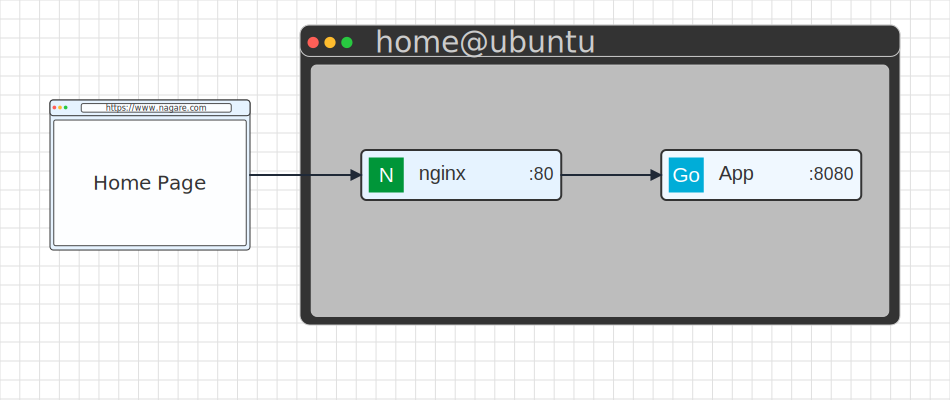

# Nagare

Nagare is a Go-based diagram rendering engine that converts a simple domain-specific language (DSL) into SVG diagrams.

## Quick Start

```bash
# Install
go install github.com/saasuke-labs/nagare@latest

# Run the server
nagare
```

## Examples

Pull requests automatically run a preview workflow that boots the Nagare server, posts the contents of [`pkg/testdiagram/test-diagram.nagare`](pkg/testdiagram/test-diagram.nagare) to the `/render` endpoint, and attaches the resulting SVG to the PR discussion for quick review.

## Layout Overrides

You can control the overall canvas dimensions with a global `@layout` directive. This is useful when you need extra room for connections or when you want diagrams to render inside a specific viewport.

```text
@layout(w: 800, h: 600)

browser:Browser@home
vps:VM@ubuntu {
    nginx:App
    app:App
}
```

The `layout` stage resolves these geometry overrides before components are instantiated, so every downstream step (child placement, connection routing, SVG rendering) respects the requested dimensions.

### Browser and VM Example

```text
@layout(w:950,h:400)

browser:Browser@home
vps:VM@ubuntu {
    nginx:Server@nginx
    app:Server@app
}

browser.e --> nginx.w
nginx.e --> app.w

@browser(x:50,y:100,w:200,h:150)
@home(url: "https://www.nagare.com", bg: "#e6f3ff", fg: "#333", text: "Home Page")

@vps(x:300,y:&browser.c,w:600,h:300)
@ubuntu(title: "home@ubuntu", bg: "#333", fg: "#ccc", text: "Ubuntu")

@nginx(x:50,y:&browser.c,w:200,h:50, title: "nginx", icon: "nginx", port: 80, bg: "#e6f3ff", fg: "#333")
@app(x:350,y:&browser.c,w:200,h:50, title: "App", icon: "golang", port: 8080, bg: "#f0f8ff", fg: "#333")
```

## Project Structure

```
cmd/
    main.go          # HTTP server and main entry point
pkg/
    components/      # SVG component definitions
    layout/         # Layout engine and geometry calculations
    parser/         # DSL parser and AST builder
    props/          # Property parsing helpers
    renderer/       # SVG rendering engine
    tokenizer/      # DSL tokenizer
    version/        # Version information
```

## Development

```bash
# Clone the repository
git clone https://github.com/saasuke-labs/nagare.git

# Build
go build ./cmd/main.go

# Test
go test ./...

# Run locally
go run ./cmd/main.go
```

## License

MIT


(grid is there to help me why developing)

## Development

The Go module under `nagare/` powers the HTTP server and static rendering pipeline. Format and test Go code before sending a pull request:

```bash
cd nagare
go test ./...
```

The layout unit tests describe how connection routing, geometry inheritance, and canvas bounds interact. They are a good starting point for understanding how new components should integrate with the existing pipeline.
