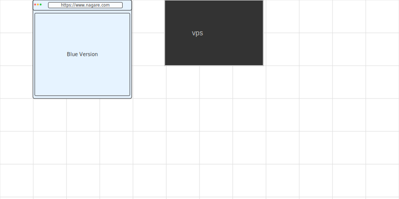

# Nagare

## Examples

### Browser and VM

This is still in progress

```text
browser:Browser@home
vps:VM {
    nginx:App
    app:App
}

@home(url: "https://www.nagare.com", bg: "#e6f3ff", fg: "#333", text: "Blue Version")
```

Becomes:


