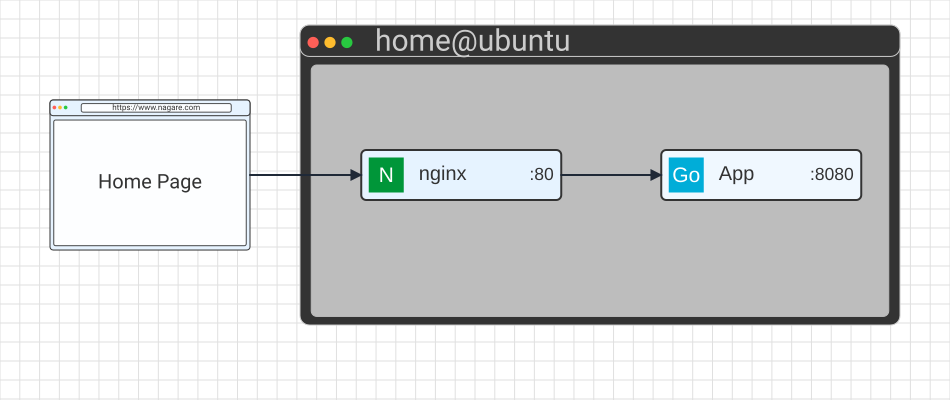

# Nagare

Nagare is a Go-based diagram rendering engine that converts a simple domain-specific language (DSL) into SVG diagrams.

## Installation

```bash
go install github.com/saasuke-labs/nagare/cmd/main@latest
```

## Usage

Nagare can be used in three ways:

### 1. HTTP Server Mode

Start the server on port 8080 (or specify a custom port):

```bash
# Default port 8080
nagare

# Custom port
nagare -port 3000
```

Send POST requests to render diagrams:

```bash
curl -X POST http://localhost:8080/render \
  -H "Content-Type: text/plain" \
  -d '@diagram.nagare'
```

### 2. CLI Mode

Render a diagram file directly to SVG:

```bash
# Render to SVG (format auto-detected from extension)
nagare -input diagram.nagare -output diagram.svg


# Explicitly specify format
nagare -input diagram.nagare -output output.file -format svg
```

### 3. Library Mode

Import nagare as a Go library in your own projects:

```go
package main

import (
    "fmt"
    "log"

    "github.com/saasuke-labs/nagare/pkg/nagare"
)

func main() {
    diagramCode := `
@layout(w:500,h:300)

client:Browser(url: "https://example.com", text: "Web App", x:50,y:100,w:180,h:120)
server:Server(title: "API Server", icon: "server", port: 8080, x:300,y:100,w:150,h:50)

client.e --> server.w
`

    svg, err := nagare.RenderToSVG(diagramCode)
    if err != nil {
        log.Fatalf("Error: %v", err)
    }

    fmt.Println(svg)
}
```

Install the library in your project:

```bash
go get github.com/saasuke-labs/nagare
```

## Syntax Notes

Nagare supports inline attributes directly on node declarations:

```text
browser:Browser(title: home, x: 50, y: 100)
db:DB(x: 10)
DB(x: 10)  # anonymous component id is auto-generated
```

`@layout(...)` and action states (for example `@db.read(...)`) are still supported.
Legacy `@id(...)` and `name:Type@state` syntax continue to work, but inline attributes are now the preferred style for component configuration.

## Layout Overrides

You can control the overall canvas dimensions with a global `@layout` directive. This is useful when you need extra room for connections or when you want diagrams to render inside a specific viewport.

```text
@layout(w: 800, h: 600)

browser:Browser(title: "home")
vps:VM(title: "ubuntu") {
    nginx:App
    app:App
}
```

The `layout` stage resolves these geometry overrides before components are instantiated, so every downstream step (child placement, connection routing, SVG rendering) respects the requested dimensions.

### Browser and VM Example

```text
@layout(w:950,h:400)

browser:Browser(url: "https://www.nagare.com", text: "Home Page", x:50,y:100,w:200,h:150)
vps:VM(title: "home@ubuntu", bg: "#333", fg: "#ccc", x:300,y:&browser.c,w:600,h:300) {
    nginx:Server(title: "nginx", icon: "nginx", port: 80, bg: "#e6f3ff", fg: "#333", x:50,y:&browser.c,w:200,h:50)
    app:Server(title: "App", icon: "golang", port: 8080, bg: "#f0f8ff", fg: "#333", x:350,y:&browser.c,w:200,h:50)
}

browser.e --> nginx.w
nginx.e --> app.w
```


### Composable Infrastructure Primitives

The infrastructure palette now supports primitive components that can be used directly in diagrams:

- `Cylinder` (base cylinder shell with title/subtitle)
- `Led` (mode-driven indicator with `mode:"green"` or `mode:"red"`)

`Led` currently supports one action: `blink` via state names like `@myLed.blink(begin:"0s",dur:"1s")`.

`Database` is now rendered as a composition of those primitives:

- 1 `Cylinder` for body + labels
- 1 red `Led` child (maps `write -> blink`)
- 1 green `Led` child (maps `read -> blink`)

So existing database actions still work (`@db.read(...)`, `@db.write(...)`), while the same visual primitives are available for custom higher-level components.

The composed database LEDs are positioned relative to the database width/height and scale proportionally with the database size, so resizing the database keeps indicator placement and sizing visually consistent.

### Component Rendering Ownership

The `pkg/diagram/components/*` packages now own per-component render-node translation.
Each component exposes `DrawFromRenderNode(id, props)` and resolves its own fallback geometry (`x`, `y`, `w`, `h`) from render props, which keeps `pkg/diagram/diagram.go` focused on tree traversal instead of per-type box defaults.
Render-tree recursion already applies parent/child `<g transform="translate(...)">` wrappers, so component templates should render using local coordinates (`x:0`, `y:0`) to avoid double-applying placement offsets.
When component actions semantically create arrows (for example request/response), keep action-to-style mapping at the owning component boundary and pass resolved geometry/style props to Arrow, keeping Arrow action-agnostic.

Parser behavior note: the parser currently records actions as state definitions (for example `@browser.request(...)`) but does not synthesize `Connection` entries from action names; explicit arrows (`from.anchor --> to.anchor`) remain the parser-level connection syntax.


## RFCs

- [RFC: Action-Driven Arrow Creation and Centralized Arrow Resolution](docs/RFC_PORT_AWARE_ARROWS.md)

## Project Structure

```
cmd/
    main.go          # HTTP server and main entry point
pkg/
    components/      # Shared SVG template/runtime primitives
    diagram/         # Diagram orchestration + component render-node translation
    layout/         # Layout engine and geometry calculations
    parser/         # DSL parser and AST builder
    props/          # Property parsing helpers
    renderer/       # SVG rendering engine
    tokenizer/      # DSL tokenizer
    version/        # Version information
static/
    playground.html  # Interactive diagram editor UI
```

## License

MIT


## Development

The Go module under `nagare/` powers the HTTP server and static rendering pipeline. Format and test Go code before sending a pull request.

### Quick Start with Just

This project uses [Just](https://github.com/casey/just) as a command runner. Install it first:

```bash
# macOS
brew install just

# Or download from https://github.com/casey/just
```

Available commands:

```bash
# Start the server
just start

# Start with hot reload (auto-restarts on code changes)
just start-watch

# Build the binary
just build

# Generate SVG from a .nagare file
just gen input.nagare output.svg

# Run tests
just test

# Run tests with coverage
just test-coverage

# Format code
just fmt

# Install development tools (air, goreleaser)
just install-tools

# Clean build artifacts
just clean
```

### CI Visual Previews

Nagare core is SVG-only. CI preview workflows publish SVG artifacts directly from Nagare output and do not perform WebP conversion in this repository.

### GCP Cloud Run Deployment CI

For a full step-by-step setup (CLI and GCP Console UI) for GitHub Actions Workload Identity Federation and Cloud Run deploys, see `docs/GCP_CLOUD_RUN_CI_SETUP.md`.

### Playground UI

Start the server and visit http://localhost:8080 to access the interactive playground. Features:

- Live diagram editor with syntax highlighting
- Instant preview rendering
- Keyboard shortcut: Cmd/Ctrl + Enter to render
- Save diagrams with custom names in browser local storage (with overwrite confirmation)
- Autosave restores your latest diagram when you return to the playground
- Example diagrams to get started

### Watch Mode

The watch mode uses [Air](https://github.com/air-verse/air) for hot reloading. It automatically restarts the server when:

- Go source files change (excluding tests)
- Component template files (.html) change

Install Air first:

```bash
just install-tools
# or manually: go install github.com/air-verse/air@latest
```

Then start with watch mode:

```bash
just start-watch
```

### Manual Development

If you prefer not to use Just:

```bash
# Clone the repository
git clone https://github.com/saasuke-labs/nagare.git

# Build
go build -o nagare ./cmd/main.go

# Test
go test ./...

# Run locally
go run ./cmd/main.go
```

The layout unit tests describe how connection routing, geometry inheritance, and canvas bounds interact.
They are a good starting point for understanding how new components should integrate with the existing pipeline.
